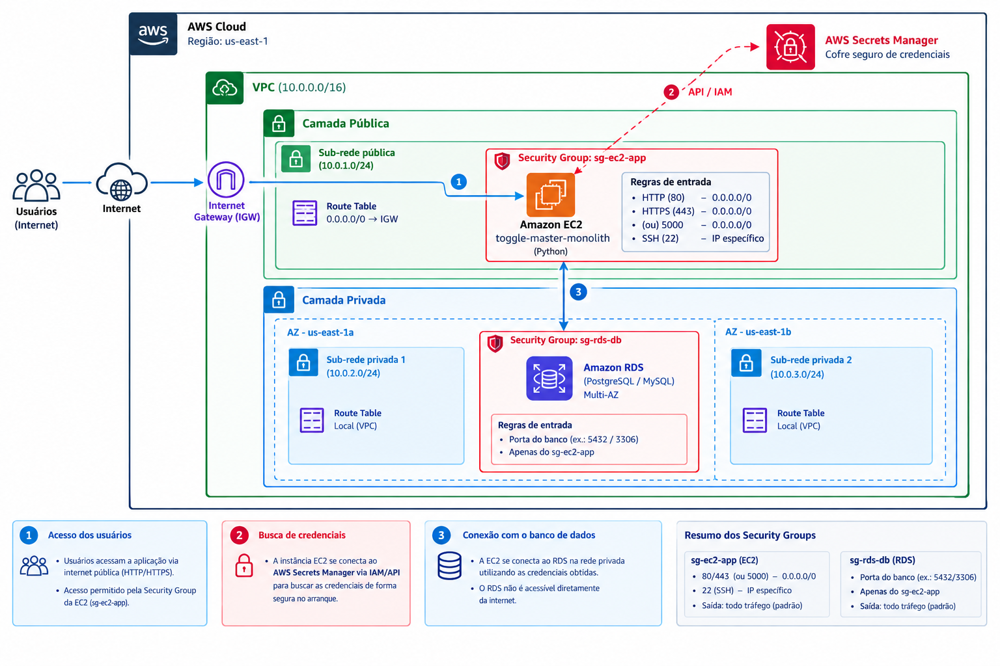

# ToggleMaster — Análise Arquitetural

## 1. Visão geral

O [ToggleMaster](https://github.com/dougls/toggle-master-monolith) é uma aplicação desenvolvida em Python com Flask para gerenciar *feature flags*, permitindo ativar ou desativar funcionalidades. Utiliza PostgreSQL para persistência dos dados, Gunicorn para execução e Docker para empacotamento.

## 2. Arquitetura monolítica

A aplicação apresenta uma arquitetura monolítica porque suas rotas e funcionalidades estão concentradas principalmente no arquivo `app.py`, sendo executadas e implantadas como uma única unidade. As operações acessam diretamente a tabela `flags` no PostgreSQL, sem uma separação clara entre as camadas de API, regras de negócio e acesso a dados.

Essa abordagem é adequada para um MVP por oferecer desenvolvimento rápido, menor custo de infraestrutura e simplicidade de implantação e manutenção inicial. Entretanto, o crescimento da aplicação pode aumentar o acoplamento entre funcionalidades, dificultar a manutenção e limitar a escalabilidade independente de seus componentes.

## 3. Análise dos 12-Factor App

A metodologia [12-Factor App](https://12factor.net/) estabelece boas práticas para desenvolver aplicações portáteis, escaláveis e confiáveis.

| Fator                         | Situação                                                                                    |
| ----------------------------- | ------------------------------------------------------------------------------------------- |
| 1. Base de código             | Atende: código versionado no GitHub.                                                        |
| 2. Dependências               | Parcial: dependências declaradas, com necessidade de controle rigoroso das versões.         |
| 3. Configurações              | Parcial: utiliza variáveis de ambiente, mas requer atenção ao gerenciamento de credenciais. |
| 4. Serviços de apoio          | Parcial: utiliza PostgreSQL, sendo importante validar a configuração para produção.         |
| 5. Build, Release, Run        | Parcial: utiliza Docker e Gunicorn, mas precisa de um processo de entrega mais estruturado. |
| 6. Processos                  | Parcial: dados persistidos no banco; é necessário garantir processos sem estado local.      |
| 7. Vínculo de porta           | Atende: API disponibilizada por uma porta de rede.                                          |
| 8. Concorrência               | Parcial: Gunicorn suporta múltiplos workers, mas requer dimensionamento.                    |
| 9. Descartabilidade           | Parcial: precisa validar inicialização, encerramento gracioso e recuperação de falhas.      |
| 10. Paridade entre ambientes  | Parcial: Docker facilita a padronização, mas não garante equivalência entre ambientes.      |
| 11. Logs                      | Parcial: recomenda-se padronização e centralização dos registros.                           |
| 12. Processos administrativos | Parcial: tarefas de inicialização devem ser separadas da execução normal da API.            |


## 4. Arquitetura Cloud na AWS

Como parte dos requisitos de infraestrutura e computação em nuvem (Requisito 2), foi desenhada uma arquitetura resiliente, segura e de baixo acoplamento para hospedar o MVP da aplicação na AWS.

### 4.1. Diagrama de Arquitetura



> **Arquivos do Diagrama:**
> - Arquivo editável no repositório: [diagramArchitectureAWS.drawio](docs/architecture/diagramArchitectureAWS.drawio)
> - Arquivo editável no GitHub (Upstream): [diagramArchitectureAWS.drawio no GitHub](https://github.com/victorT420/Tech-Challenge-Fase-01-ToggleMaster/blob/main/docs/architecture/diagramArchitectureAWS.drawio)
> - Export em alta resolução: [diagramaAWSCloud.png](docs/architecture/diagramaAWSCloud.png)
> - Visualizar/Editar online: [Abrir no diagrams.net (draw.io)](https://app.diagrams.net/?url=https://raw.githubusercontent.com/victorT420/Tech-Challenge-Fase-01-ToggleMaster/main/docs/architecture/diagramArchitectureAWS.drawio)

---

### 4.2. Componentes da Infraestrutura

1. **Rede e Isolamento (VPC e Subnets):**
   - **VPC** dedicada com bloco CIDR `10.0.0.0/16` na região `us-east-1`.
   - **Camada Pública:**
     - `Sub-rede pública` (`10.0.1.0/24`) associada a uma Route Table com rota padrão `0.0.0.0/0` apontando para o **Internet Gateway (IGW)**, permitindo entrada e saída para a internet.
   - **Camada Privada (Multi-AZ):**
     - Duas sub-redes privadas em zonas de disponibilidade distintas: `Sub-rede privada 1` (`10.0.2.0/24` em `us-east-1a`) e `Sub-rede privada 2` (`10.0.3.0/24` em `us-east-1b`).
     - As tabelas de rota são estritamente locais (`Local VPC`), impedindo qualquer rota direta para a internet e atendendo aos pré-requisitos de alta disponibilidade do DB Subnet Group do Amazon RDS.

2. **Camada de Aplicação (Amazon EC2):**
   - Instância EC2 provisionada na **sub-rede pública**, responsável por executar a aplicação monolítica Python/Flask (`toggle-master-monolith`) sob o servidor de aplicação Gunicorn.
   - Acesso público via IP Elástico/DNS público para os endpoints da API.

3. **Camada de Dados (Amazon RDS):**
   - Instância de banco de dados gerenciado **Amazon RDS** (PostgreSQL / MySQL) provisionada na **camada privada** em arquitetura Multi-AZ.
   - Sem atribuição de IP público, ficando totalmente isolada de acessos externos.

4. **Gerenciamento Seguro de Credenciais (AWS Secrets Manager):**
   - Credenciais de acesso ao banco e variáveis sensíveis são armazenadas no **AWS Secrets Manager**.
   - A instância EC2 consulta o Secrets Manager via API/IAM Role anexada (sem chaves hardcoded no código ou instâncias), garantindo conformidade com o Fator 3 dos 12-Factor App.

---

### 4.3. Estratégia de Segurança (Security Groups)

A segurança em camadas foi configurada utilizando o princípio do menor privilégio através de Security Groups:

| Recurso | Security Group | Regra | Porta / Protocolo | Origem / Destino | Descrição |
| :--- | :--- | :--- | :--- | :--- | :--- |
| **EC2** | `sg-ec2-app` | Entrada (Inbound) | `80` (HTTP) / `443` (HTTPS) / `5000` | `0.0.0.0/0` | Tráfego web dos usuários |
| **EC2** | `sg-ec2-app` | Entrada (Inbound) | `22` (SSH) | `IP do Administrador/32` | Acesso administrativo seguro |
| **EC2** | `sg-ec2-app` | Saída (Outbound) | Todas | `0.0.0.0/0` | Saída padrão para pacotes e AWS APIs |
| **RDS** | `sg-rds-db` | Entrada (Inbound) | `5432` (PostgreSQL) / `3306` (MySQL) | `sg-ec2-app` (ID do Security Group) | **Apenas conexões vindas da EC2** |
| **RDS** | `sg-rds-db` | Saída (Outbound) | Todas | `0.0.0.0/0` | Saída padrão |

> [!IMPORTANT]
> O Security Group do RDS (`sg-rds-db`) aceita conexões na porta do banco exclusivamente referenciando o ID do Security Group da aplicação (`sg-ec2-app`), inviabilizando qualquer conexão direta a partir da internet pública.

---

### 4.4. Fluxo Operacional

```
[ Usuários (Internet) ]
         │ (HTTP / HTTPS)
         ▼
[ Internet Gateway (IGW) ]
         │
         ▼
[ Amazon EC2 (sg-ec2-app) ] ──( IAM / API )──► [ AWS Secrets Manager ]
         │                                       (Busca credenciais no boot)
         │ (Conexão interna privada na porta 5432 / 3306)
         ▼
[ Amazon RDS (sg-rds-db) ]
```

1. **Acesso do Usuário:** Clientes enviam requisições HTTP/HTTPS via Internet Gateway para a EC2 na sub-rede pública.
2. **Boot e Credenciais:** No arranque da aplicação, a EC2 requisita as credenciais de banco ao AWS Secrets Manager via IAM Role.
3. **Persistência Segura:** A aplicação conecta-se ao Amazon RDS na sub-rede privada através do endereço interno (endpoint privado), autenticando com as credenciais obtidas.

---

## 5. Estimativa de Custos (AWS Pricing Calculator)

A estimativa mensal de custos para a infraestrutura básica foi projetada através da [AWS Pricing Calculator](https://calculator.aws/):

* **Amazon EC2:** Instância `t3.micro` / `t4g.micro` (ou elegível ao Free Tier), 1 vCPU, 1 GB RAM, volume EBS gp3 de 20 GB.
* **Amazon RDS:** Instância `db.t3.micro` / `db.t4g.micro` Single-AZ ou Multi-AZ para testes, armazenamento gp3 de 20 GB.
* **VPC & Data Transfer:** Custos mínimos dentro da franquia inicial gratuita da AWS.
* **AWS Secrets Manager:** Armazenamento de 1 segredo com chamadas de leitura na inicialização.

> *Nota: Os prints detalhados e o link oficial exportado da calculadora de preços serão anexados ao Relatório de Entrega da Fase 1.*

---

## 6. Melhorias recomendadas

Para tornar a aplicação mais robusta em produção, recomenda-se proteger credenciais, automatizar testes e implantações com CI/CD, centralizar logs, implementar verificações de saúde, dimensionar os processos do Gunicorn e separar as migrações do banco da inicialização da API.

## 7. Conclusão

A arquitetura monolítica é adequada ao MVP por sua simplicidade e baixo custo inicial. A aplicação já apresenta uma base para execução em contêineres e utilização de serviços externos, mas precisa aprimorar aspectos de segurança, automação, observabilidade e confiabilidade para produção. Essas melhorias podem ser implementadas sem migrar para microsserviços, mantendo a arquitetura atual até que o crescimento do sistema justifique mudanças.

## Referências

* [Repositório Principal do Projeto (Tech Challenge)](https://github.com/victorT420/Tech-Challenge-Fase-01-ToggleMaster)
* [Repositório Original do Monólito (ToggleMaster)](https://github.com/dougls/toggle-master-monolith)
* [Metodologia 12-Factor App](https://12factor.net/)
* [AWS Architecture Icons & Best Practices](https://aws.amazon.com/architecture/)
* [Calculadora de Preços da AWS](https://calculator.aws/)


